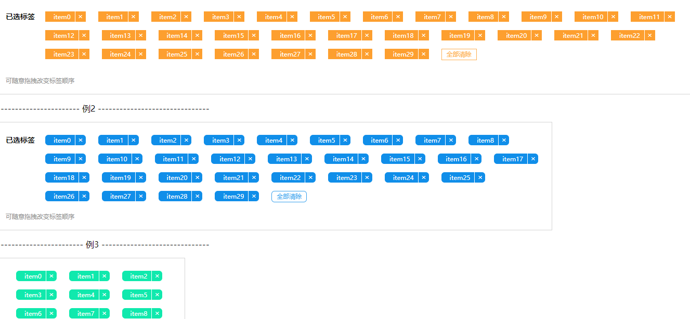

## react-dnd-block

* Created By ancf - (博客地址)[https://kafeihaoka.github.io/myBlog.html#/welcome]

* react-dnd-block 为一款基于react-dnd实现的标签维度拖拽排序组件，可自定义UI样式。



DEMO示例地址：https://kafeihaoka.github.io/react-dnd-block/

## 安装依赖
npm i react-dnd-block -S

## API 介绍

| Property | Description | Type | Default |
| --- | --- | --- | --- |
| data | 设置组件数据 | array | - |
| width | 设置拖拽区域宽度 | string | 100% |
| className | 增加拖拽区域自定义class | string | '' |
| title | 拖拽区域label文字 | string | 已选 |
| tagColor | 拖拽区域标签颜色自定义 | string | '#fd9f2f' |
| tagBorderRadius | 拖拽区域标签自定义圆角 | array | ['0px', '0px'] |
| clearButtonBorderRadius | 拖拽区域清空标签自定义圆角 | string | '0px' |
| clearButton | 是否开启全部清除按键 | bool | true |
| hint | 拖拽区域底部提示段落 | string | '可随意拖拽改变标签顺序' |
| onChange | 拖拽排序及删除操作 | function(e){} | - |

> 彩色块数据

    data: [],  注入组件数据
    
    data数据模型 ==>
    
            [{
                label:'',
                value:0
              },
              {
                  ...同上
              },
               {
                  ...同上
               },
               {
                  ...同上
               }
            ]
    
> function 选择

    onChange: ()=> {},  返回最新的data数据，注意在此方法里将返回的data数据设置为最新的data数据；
    

## 用法示例

```

import DNDBlock from "react-dnd-block";

class DNDBlockDemo extends React.Component {
      state = {
        data :Array.from({length:60}).map((v,i) => ({label:'item' + i,value:i}))
      };

    changeBlock = (v) => {
        console.log(v)
        this.setState({
            data: v
        })
    }

  render() {
    const { data } = this.state;
    return (
      <div>
        <DNDBlock
          data={data}
          onChange={this.changeBlock}
        />
      </div>
    );
  }
}

ReactDOM.render(<DNDBlockDemo />, mountNode);

```

## 相关资料

- react  react-dnd   react-dnd-html5-backend

[API](http://react-dnd.github.io/react-dnd/examples/dustbin/single-target)

[react-dnd-html5-backend]https://react-dnd.github.io/react-dnd/docs/backends/html5